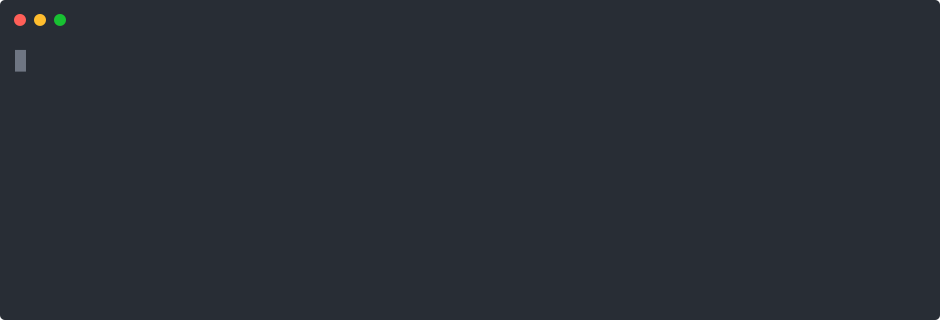

  

  

  

  

 

  

---

### `> cat /var/www/projects/Attend-ED/readme.md`
**A modern student attendance application focusing on seamless identity verification.**
* **Core Mechanics:** Integrates vector matching algorithms to securely and accurately verify student identities. Integrates geo-fenced attendance marking to prevent fraud in signing attendances.
* **Scope:** Full-stack development spanning technical architecture, UI mockups, and mobile application implementation.
* **Tech Stack:** `ASP.NET Core` • `.NET MAUI` • `MVVM` • `EF Core` • `PostgreSQL` • `JWT Authentication` • `Docker`
* 🔗 **Live URL:** [Attend-ED Frontend](https://attend-ed-frontend.onrender.com/login)
* 🔗 **Backend Repo:** [GitHub Link](https://github.com/Prince-Derrek/Attend-Ed) | **Frontend Repo:** [GitHub Link](https://github.com/Prince-Derrek/Attend-Ed-Frontend)

 

### `> cat /var/www/projects/SMPS-Exam-System/readme.md`
**A high-throughput Web-Based University Examination Booking, Payment and Verification System.**
* **Core Mechanics:** Designed to handle concurrent booking requests with strict transaction integrity and deployment planning.
* **Scope:** Spearheading an engineering team, focusing on structured execution, backend architecture, and clean project delivery.
* **Tech Stack:** `ASP.NET Core` • `PostgreSQL` • `EF Core` • `Hangfire` • `React.js` • `Github Workflows (CI/CD)`
* 🔗 **Live URL:** [SMPS Portal](https://smps-portal.onrender.com)
* 🔗 **Repository:** [GitHub Link](https://github.com/Prince-Derrek/smps-exam-system)

 

### `> cat /var/www/projects/WhatsApp-Integration-API/readme.md`
> **Proprietary Project — Source Code Cannot Be Shared (Access Denied)**

**A production-grade messaging integration API designed to power internal systems with secure, auditable WhatsApp communication.** This project demonstrated enterprise-level backend engineering, clean architecture, security hardening, and scalable API design.
* **Highlights:** Clean Architecture, Domain-Driven design, JWT Authentication, Service-to-Service Authorization, Dynamic Policy-Based Access Control, Structured Logging with Serilog.
* **Tech Stack:** `ASP.NET Core 8` • `SQL Server` • `EF Core` • `AutoMapper` • `Serilog` • `Modular-Monolith Architecture`

 

### `> cat /var/www/projects/Car-Rental-System/readme.md`
**A full-stack application for renting and listing vehicles in a peer-to-peer (P2P) marketplace model.** The standout feature is Real-time GPS vehicle tracking, streaming telemetry using SignalR and displayed on an interactive Leaflet.js map.
* **Tech Stack:** `ASP.NET Core MVC` • `SQL Server` • `EF Core` • `SignalR` • `Leaflet.js`
* 🔗 **Repository:** [GitHub Link](https://github.com/Prince-Derrek/Car-Rental-Management-System)

 

  

 

  

 

  <!-- This snake image will 404 error until our GitHub Action runs for the first time -->
  <picture>
    <source media="(prefers-color-scheme: dark)" srcset="https://raw.githubusercontent.com/Prince-Derrek/Prince-Derrek/output/github-contribution-grid-snake-dark.svg">
    <source media="(prefers-color-scheme: light)" srcset="https://raw.githubusercontent.com/Prince-Derrek/Prince-Derrek/output/github-contribution-grid-snake.svg">
    
  </picture>

